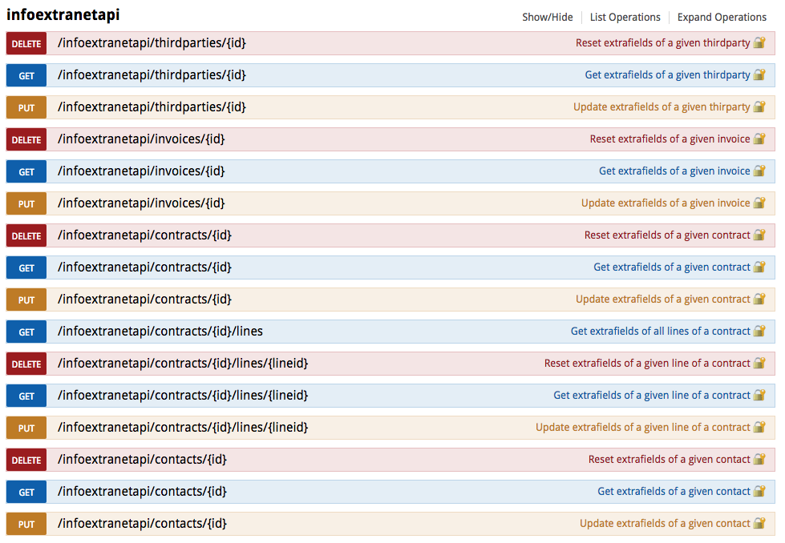

 

# Sommaire

---

### [1. Extrafields](#1)

### [2. Actions de masse](#2)

### [3. Dictionnaires](#3)

 

# Utilisation

---

## API

Le module ajoute les endpoints suivants à l'api (voir photo) :

 

# Informations complémentaires

---

Le module API de base de Dolibarr ne fonctionne pas avec NGINX. Il faudra donc effectuer une petite manipulation pour pouvoir utiliser l'API Explorer de Dolibarr.

* Remplacer le fichier api/index.php par celui ci : https://raw.githubusercontent.com/7PH/dolibarr/develop/htdocs/api/index.php

* Editer le fichier de configuration des sites-enabled et remplacer la ligne :

<pre style="background-color:lightgrey"> location ~ \.php$ { </pre>

<pre style="background-color:lightgrey">
// Ouvrir le fichier
$> sudo nano /etc/nginx/sites-enabled/site_name.test
// Commenter : location ~ \.php$ {
// Ajouter : location ~ [^/]\.php(/|$) {
// (Voir la photo pour un exemple)
</pre>

<pre style="background-color:lightgrey">
// Redemarer les services nginx
$> sudo /etc/init.d/nginx restart
</pre>

* Votre API Explorer sera ensuite utilisable. Ne pas oublier d'activer et de configurer le module API/Web services (serveur REST).

 

# Information sur les extrafields 

---

Il y a différentes section sur le module. Pour reconnaitre les différentes sections et l'appartenance des extrafields à une section, nous utilisons un préfix :

* Section Outils externes (c42O_)

* Section Etat Parc / Maintenance (c42M_)

* Section Hébergement Web (c42H_)

* Section Hébergement S.I (c42SI_)

* Section Infra poste (c42P_)

* Section Infra réseau (c42R_)

> *Note : les extrafields dictionnaire seront de type sellist associé à la table du dictionnaire*

## Comment créer un extrafield dans une section ?

Pour créer un extrafield dans Info Extranet, il faudra se rendre dans le descripteur du module (core/module/modInfoExtranet.class.php). J'ai créé une fonction qui permet de modifier un extrafield existant ou de le créer si il n'existe pas. Il s'agit de la fonction

<pre style="background-color:lightgrey">
     /**
      *      Update or create extrafields if it doesn't exist
      *
      *      @param      Extrafield      $extrafields            Extrafield class
      *      @param      string          $attrname               Code of attribute
      *      @param      string          $label                  Label of attribute
      *      @param      int             $type                   Type of attribute ('int', 'text', 'varchar', 'date', 'datehour', 'float')
      *      @param      int             $pos                    Position of attribute
      *      @param      int             $size                   Size of attribut
      *      @param      string          $default_value          Default value on database
      *      @param      string          $elementtype            Element type ('member', 'product', 'thirdparty', ...)
      *      @param      array | string  $param                  Params for field (ex for select list : array('options' => array(value'=>'label of option')) )
      *      @param      int             $alwayseditable         Is attribute always editable regardless of the document status
      *      @param      int             $hidden                 Visibility
      *      @return     int                                     <= 0 on error, > 0 on success
      */
 private function addUpdateExtrafields($extrafields, $attrname, $label, $type, $pos, $size, $default_value, $elementtype, $param, $alwayseditable, $hidden)
</pre>

## Exemple avec la création d'un extrafield particulier

Pour la création d'extrafields dépendant d'un **dictionnaire**, il faut déclarer un extrafield de type **sellist** et remplir l'attribut **'param'**.

Exemple de l'attribut param pour un dictionnaire contenu dans la table llx_test:

<pre style="background-color:lightgrey">
 array("options" => array("test:label:rowid::active=1" => null))
</pre>

> Note : On déclare un tableau dont l'attribut **'option'** sera un tableau contenant un attribut. Cet attribut permettra d'assigner l'extrafield à la table llx_test avec quelques options.

<pre style="background-color:lightgrey">
 "test:label:rowid::active=1"
</pre>

Equivaut à

<pre style="background-color:lightgrey">
 SELECT label, rowid FROM llx_test WHERE active = 1;
</pre>

## Comment positionner un extrafield dans une section ?

La gestion de la position est un système particulier. En effet, nous avons fait un système qui permet de positionner un extrafield où l'on veut dans l'onglet 'Etat de parc'.

Pour ce positionnement, nous utilisons l'attribut position d'un extrafield (la variable $pos dans la fonction ci dessus).

<pre style="background-color:lightgrey">
 // Première section
 $pos = 42000;

 // Deuxième section
 $pos = 42100;

 // Troisième section
 $pos = 42200;

</pre>

Types existant pour class fields : date, datetime, url, boolean, text, html, price, double, select, sellist, checkbox, radio, chkbxlst, link, password.

 

# Actions de masse 

---

## Information sur l'implémentation des actions de masse.

Les actions de masse sont des actions permettant d'effectuer une tâche particulière sur une liste d'objets sélectionnés (suppression, duplication, création de PDF, etc).
> *Note : Ici l'exemple sera pris sur l'implémentation d'une duplication de masse. Les lignes données sont ici à titre indicatif afin de mieux se repérer au sein des fichiers.*

## Comment implémenter une action de masse ?

Pour implémenter une action de masse dans InfoExtranet, il faudra se rendre dans le descripteur du module (*core/module/modInfoExtranet.class.php*), et créer le droit correspondant à l'action voulu.

<pre style="background-color:lightgrey">
$this->rights = array();
$r++;
$this->rights[$r][0] = $this->numero + $r;
$this->rights[$r][1] = 'Clone extrafields info with InfoExtranet';
$this->rights[$r][3] = 1;
$this->rights[$r][4] = 'clone';
$this->rights[$r][5] = '';
</pre>

## Inclure l'action de masse :

Pour inclure une nouvelle action de masse il suffit de copier le contenu de "*infoextranet/clone_massaction.php*" dans un nouveau fichier et de remplacer les champs contenant "clone" par le nom de l'action voulu.
Une fois cela fait, il suffit d'inclure le dit fichier dans les fichiers de type "myclass_list.php".

___Ligne 189 :___
<pre style="background-color:lightgrey">
// Mass actions
$objectclass='NetworkDevice';
$objectlabel='NetworkDevice';
$permtoread = $user->rights->infoextranet->read;
$permtodelete = $user->rights->infoextranet->delete;
$uploaddir = $conf->infoextranet->dir_output;
include DOL_DOCUMENT_ROOT.'/core/actions_massactions.inc.php';
// Include for clone massaction
include DOL_DOCUMENT_ROOT. '/custom/infoextranet/clone_massaction.php';
</pre>

## Ajout de l'action et de son droit dans le tableau des actions de masse.

Afin de pouvoir utiliser et sélectionner l'action en question une fois sur la liste des objets, il faut l'ajouter au tableau des actions de masse avec le droit définit précédemment.

___Ligne 355 :___
<pre style="background-color:lightgrey">
if ($user->rights->infoextranet->clone) $arrayofmassactions['preclone']=$langs->trans("Cloner");
if (in_array($massaction, array('presend','predelete', 'preclone'))) $arrayofmassactions=array();
</pre>

## Popup de confirmation :

Enfin pour obtenir le message de confirmation quant à l'activation de l'action de masse, il suffit de d'invoquer la fonction *formconfirm()* comme ceci :

___Ligne 366 :___
<pre style="background-color:lightgrey">
if ($massaction == 'preclone')
{
    print $form->formconfirm($_SERVER["PHP_SELF"], $langs->trans("ConfirmMassClonage"),
    $langs->trans("ConfirmMassClonageQuestion", count($toselect)), "clone", null, '', 0, 200, 500, 1);
}
</pre>

> *N.B. : N'oubliez pas de créer la méthode correspondante à l'action dont vous avez besoin afin de pouvoir correctement l'invoquer.*

 

# Ajout d'un dictionnaire 

---

Pour ajouter un nouveau dictionnaire, il suffit d'implémenter de nouveaux paramètres dans le fichier *modInfoExtranet.class.php* et de créer une table correspondant aux paramètres donnés.

___Exemple :___
<pre style="background-color:lightgrey">
$this->dictionaries=array(
            'langs'=>'mylangfile@infoextranet',
            'tabname'=>array(MAIN_DB_PREFIX."table1",MAIN_DB_PREFIX."table2",MAIN_DB_PREFIX."table3"),
            'tablib'=>array("Table1","Table2","Table3"),
            'tabsql'=>array('SELECT f.rowid as rowid, f.code, f.label, f.active FROM '.MAIN_DB_PREFIX.'table1 as f',
                            'SELECT f.rowid as rowid, f.code, f.label, f.active FROM '.MAIN_DB_PREFIX.'table2 as f',
                            'SELECT f.rowid as rowid, f.code, f.label, f.active FROM '.MAIN_DB_PREFIX.'table3 as f'),
            'tabsqlsort'=>array("label ASC","label ASC","label ASC"),
            'tabfield'=>array("code,label","code,label","code,label"),
            'tabfieldvalue'=>array("code,label","code,label","code,label"),
            'tabfieldinsert'=>array("code,label","code,label","code,label"),
            'tabrowid'=>array("rowid","rowid","rowid"),
            'tabcond'=>array($conf->infoextranet->enabled,$conf->infoextranet->enabled,$conf->infoextranet->enabled)
        );
</pre>

## Associer un dictionnaire à un objet :

Pour rendre un objet dépendant d'un **dictionnaire**, il faut déclarer un champ de type **sellist** et remplir l'attribut **'param'**.

Exemple de l'attribut param pour un dictionnaire contenu dans la table llx_infoextranet_test:

<pre style="background-color:lightgrey">
array("options" => array("infoextranet_test:label:rowid::active=1" => null))
</pre>

> *Note : On déclare un tableau dont l'attribut **'option'** sera un tableau contenant un attribut. Cet attribut permettra d'assigner l'objet à la table llx_infoextranet_test avec quelques options.*

<pre style="background-color:lightgrey">
"infoextranet_test:label:rowid::active=1"
</pre>

Equivaut à :

<pre style="background-color:lightgrey">
SELECT label, rowid FROM llx_infoextranet_test WHERE active = 1;
</pre>

___Exemple :___
<pre style="background-color:lightgrey">
public $fields=array(
// [...]
'types' => array('type'=>'sellist', 'param'=>array("options" => array("infoextranet_test:label:rowid::active=1" => null)),
'label'=>'Type', 'visible'=>1, 'enabled'=>1, 'position'=>1)
// [...]
);
</pre>

 