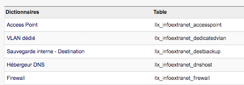

# Description

---

* Le module InfoExtranet premet de gérer et prendre compte de l'état d'un parc informatique au sein de DOLIBARR. Pour cela, il va ajouter plusieurs onglets complémentaires aux tiers afin de regrouper des informations sur les états des parcs.

* Il permet de peupler les parcs en créant différent type d'objet :
    * Des applications,
    * Des équipements,
    * Des adresses,
    * Des rôles.

* Il ajoute 3 onglets complémentaires aux tiers :
    * L'onglet "État de Parc",
    * L'onglet "Applications",
    * L'onglet "Équipements".

* Ce module a été développé afin de faciliter la gestion des parcs informatiques.

 

# Les onglets ajoutés aux tiers

---

### Les onglets sur la fiche d'un tiers

* L'onglet "État de Parc" permet de lister et modifier ces champs. Ils sont séparés en 6 sections (voir image) :
    * Outils Externes,
    * État Parc / Maintenance,
    * Hébergement S.I,
    * Hébergement Web,
    * Infrastructure poste,
    * Infrastructure réseau.

* Ces informations peuvent être éditées via le bouton "Modifier" en bas à droite de la fiche du tiers.

> *NB : Une sections ne sera pas affichée si elle ne contient pas d'information ou si son numéro de contrat est négatif.*

* L'onglet "Applications" permet de lister, d'associer ou désasocier une application au dit tiers. Il est séparé en 2 sections :
    * Applications possédées,
    * Applications maintenues par le tiers.

* L'onglet "Équipement" permet de lister, d'associer ou désasocier un équipement au dit tiers. Il est séparé en 3 sections (voir image) :
    * Équipements sous contrat,
    * Autres équipements (sous entendu ceux qui ne sont pas sous contrat),
    * Équipements maintenus par le tiers.

    

 

# Les menus propres au module

---

### Menu InfoExtranet

Le module ajoute un nouveau menu divisé en 5 sous-menus (un par section).
Chaque page permet de lister toutes les informations des parcs, de tous les tiers, par section (voir image).

### Les cartes des objets (Applications, Équipements, Adresses, Rôles)

* Fonctionnalités sur chaque carte (voir image):
    * Création,
    * Modification,
    * Clonage,
    * Suppression,
    * Liaison à un événement.

* A la création et modification de certain objet, des liens permettant la saisie rapide d'autres données sont présents.

* Chacuns de ces différents objets peuvent être associés à d'autres sous forme de liste comme ci-dessous (voir image).
    * Les applications sont liées aux tiers et aux rôles.
    * Les équipements sont liés aux adresses et aux rôles.
    * Les adresses sont liées aux équipements et aux rôles.
    * Les rôles sont liés aux application, équipement et adresses.

    

### Les listes des objets (Applications, Équipements, Adresses, Rôles)

Le module InfoExtranet comporte une liste pour chaque type d'objet, les répertoriant dans leur totalité.
Ces listes premettent la recherche d'un objet en particulier grâce aux différents champs de recherche au dessus de celle-ci (recherche par tiers, type de l'objet, etc).
Certaines actions dites de "masses" peuvent être utilisées sur les objets de ces listes (suppressions/ duplications silmultanés).
 
 

### Dictionnaires propres à InfoExtranet

InfoExtranet détient sa propre liste de dictionnaire directement éditable. C'est ici que différentes informations comme les "Types d'OS ou Firmware", les "Marques des équipements" peuvent être saisis afin de pouvoir être utilisé pour certain objet (voir ci-dessous).

 

# Informations techniques

---

### Configuration

InfoExtranet ne doit pas être configuré avant son utilisation, il peut être utilisé dès son activation.
Le module fonctionne avec le module Evenement de CODE42, il l'activera automatiquement si celui-ci est présent.

### Important

Le module se s'installe avec ses propres gestions des droits. Il faudra donc donner les droits aux utilisateurs pour qu'ils puissent pleinement utiliser InfoExtranet.

 